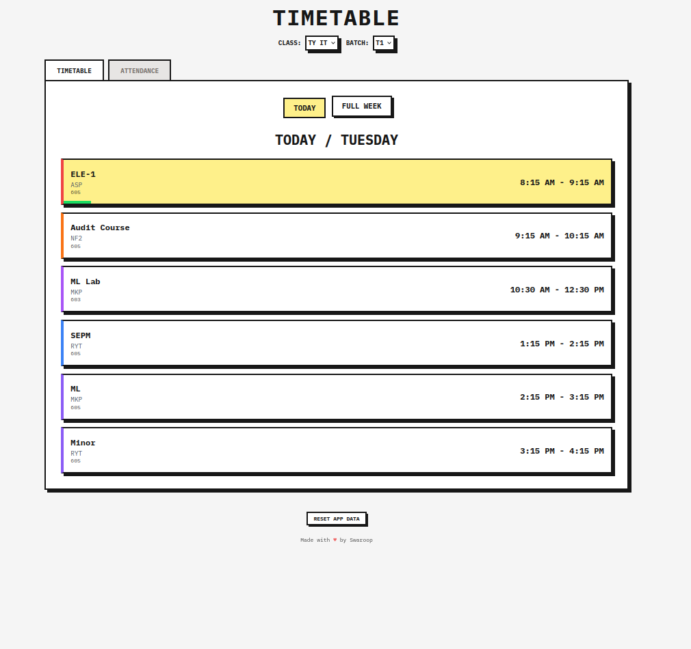
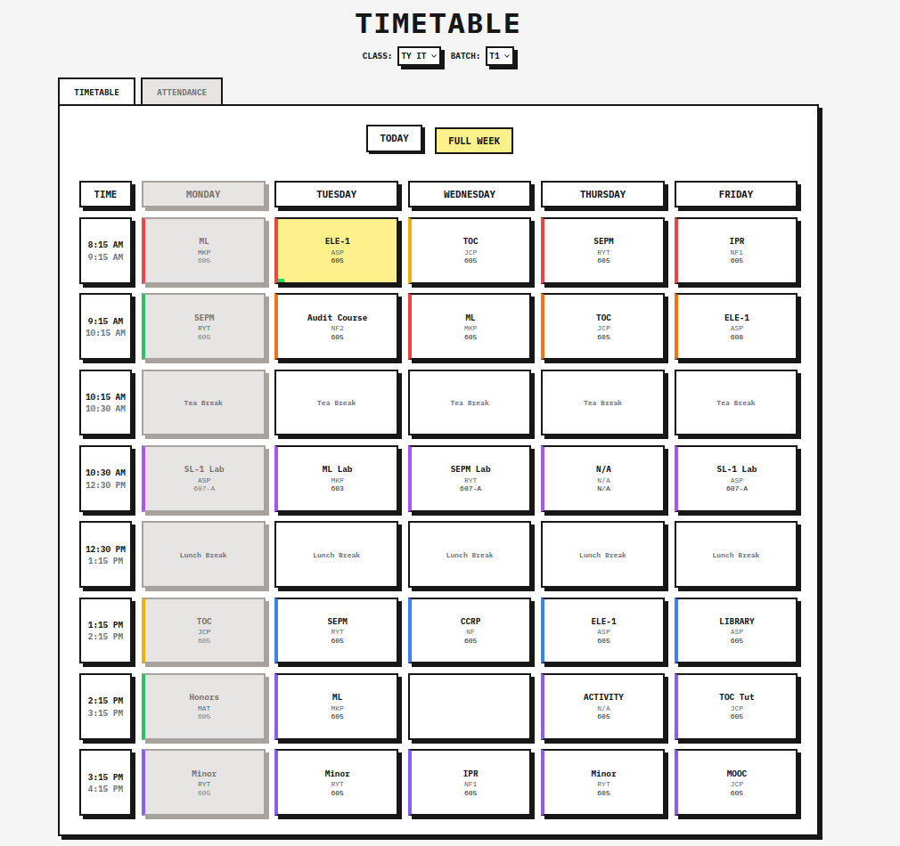
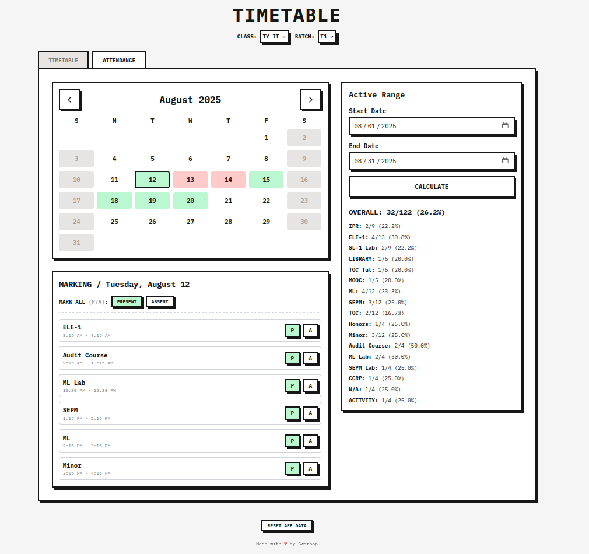

# Timetable

Fast, offline-first timetable and attendance tracker with a clean, punchy UI. No server. No build. Just open and use.

## Features
- Today and week views
- Attendance with calendar
- Everything saved locally (localStorage)
- Installable PWA, works fully offline
- Handy shortcuts: mark day Present (P) / Absent (A)

---

## Tech stack
- Vanilla JS (ES6+)
- Tailwind CSS (CDN)
- Lucide Icons

No frameworks. No build steps.

---

## Screenshots

<details>
  <summary>Tap to view screenshots</summary>

  <p align="center">
    
  </p>
  <p align="center">
    
  </p>
  <p align="center">
    
  </p>

</details>

---

## Timetable data format

Timetable data lives in `data.js` as `timetableData`.

You can:
- Add more days to an existing timetable
- Add new timetables for other classes/batches

<details>
  <summary>Example (tap to expand)</summary>

```js
const timetableData = [
  {
    id: "ty-it", // Unique ID for this timetable
    displayName: "TY IT", // Display name for UI
    batches: ["T1", "T2", "T3"],

    days: [
      {
        day: "Monday",
        dayIndex: 1, // 1 = Monday, 2 = Tuesday, etc.
        slots: [
          {
            time: "08:15-09:15",
            type: "lecture",
            subject: "ML",
            teacher: "MKP",
            room: "605",
            color: "#ef4444"
          },
          {
            time: "10:30-11:30",
            type: "lab",
            color: "#a855f7",
            batches: [
              { name: "T1", subject: "SL-1 Lab", teacher: "ASP", room: "607-A" },
              { name: "T2", subject: "SEPM Lab", teacher: "RYT", room: "607-A" },
              { name: "T3", subject: "SL-1 Lab", teacher: "NF1", room: "607-B" }
            ]
          }
        ]
      }

      // Add more days here...
    ],

    timeSlots: [
      { start: "08:15", end: "09:15" },
      { start: "09:15", end: "10:15" },
      { start: "10:15", end: "10:30", label: "Tea Break" },
      { start: "10:30", end: "11:30" },
      { start: "11:30", end: "12:30" },
      { start: "12:30", end: "13:15", label: "Lunch Break" },
      { start: "13:15", end: "14:15" },
      { start: "14:15", end: "15:15" },
      { start: "15:15", end: "16:15" }
    ]
  }

  // Add another timetable here for a different class or section...
];
```

</details>

---

## Contributing

<details>
  <summary>How to contribute (tap to expand)</summary>

1) Fork and clone

```bash
git clone https://github.com/swarooppatilx/timetable.git
cd timetable
```

2) Make changes
- Edit `timetableData` in `data.js`
- Update styles in `style.css` or Tailwind classes in `index.html`
- Add features/fixes in `app.js`

3) Test locally
- Open `index.html` directly, or run a local server:

```bash
python -m http.server -d public/
```

4) Commit and push

```bash
git add .
git commit -m "feat: add new timetable for SY IT"
git push origin main
```

5) Open a Pull Request on GitHub

</details>
